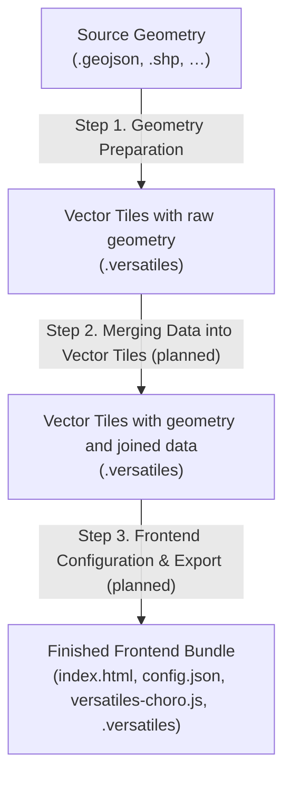
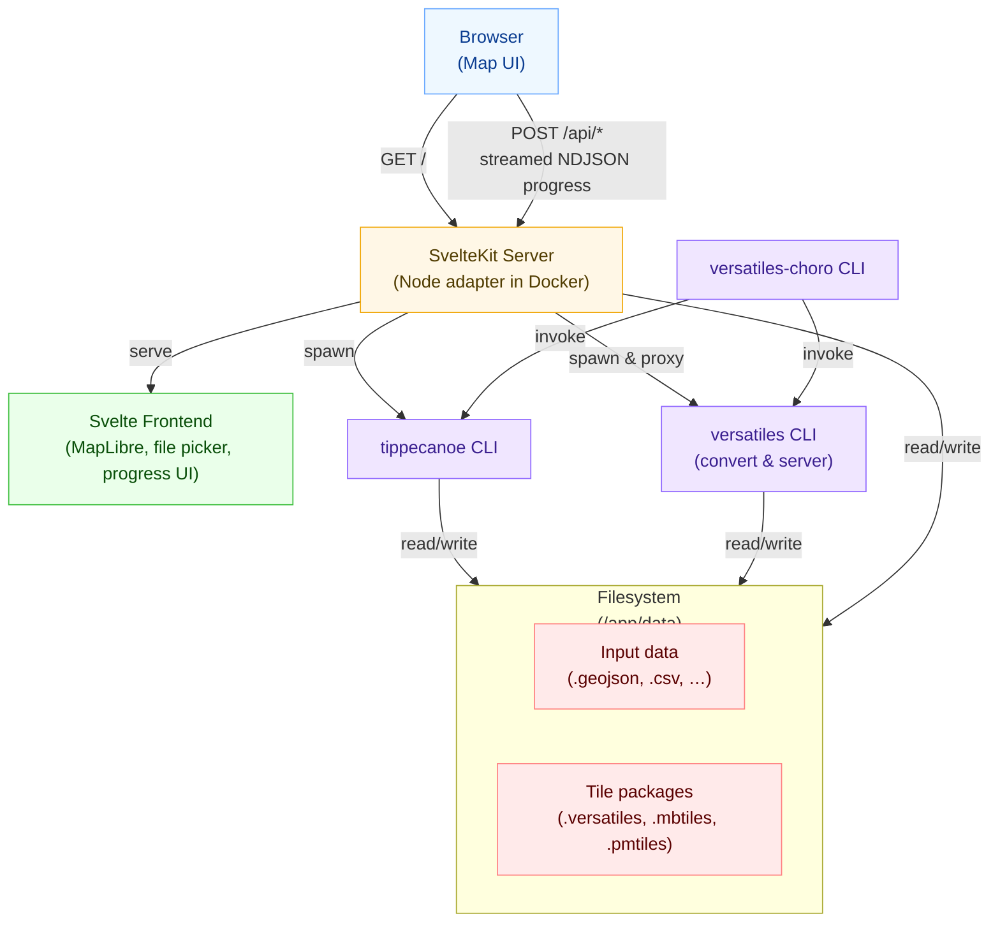

# VersaTiles Choro

> [!CAUTION]
> This project is under heavy development! The API, UI, and configuration formats will change. Do **not** use it in production yet.

**An open‑source toolkit for creating, editing, and publishing choropleth maps — from raw geometries to interactive web visualizations.**

---

## Introduction

**VersaTiles Choro** is a modular, open‑source workflow for building **choropleth maps** — maps where regions are colored according to data values.  
It is designed for newsrooms, data journalists, and developers who want an editorially controlled, reproducible way to visualize spatial data.

At the moment, VersaTiles Choro is an **early‑stage workbench** that focuses on:

- converting polygon geometries into vector tiles (`.versatiles` containers),
- running these conversions inside a Docker container,
- previewing the resulting tiles on a background map, and
- exposing the same conversion pipeline as a CLI.

Many of the more advanced features described below are **planned but not fully implemented yet** (e.g. CSV joins, full choropleth style editor, static export bundle).

---

## Running the Docker Container

A prebuilt Docker image is available on GitHub Container Registry:

https://github.com/versatiles-org/versatiles-choro/pkgs/container/versatiles-choro

To start the WebUI locally, run:

```bash
docker pull ghcr.io/versatiles-org/versatiles-choro:latest
docker run -it -p 3000:3000 ghcr.io/versatiles-org/versatiles-choro:latest
```

The interface will be available at:

```text
http://localhost:3000
```

You can mount a local directory to persist inputs and outputs such as `.versatiles` containers:

```bash
docker run -it \
  -p 3000:3000 \
  -v "$(pwd)":/app/data \
  ghcr.io/versatiles-org/versatiles-choro:latest
```

Inside the container:

- `/app/data` is the **working directory**.
- The WebUI’s file picker operates relative to this directory.
- Conversion outputs are written back into `/app/data`.

---

## CLI Usage

The project also ships a Node‑based CLI. Run the Docker container but add `cli` as command:

```bash
docker run -v "$(pwd)":/app/data ghcr.io/versatiles-org/versatiles-choro:latest cli
```

---

## Concept Overview (Planned Workflow)

Long‑term, VersaTiles Choro is designed as a three‑step workflow — plus an optional developer layer for deeper customization.

### Step 1. Geometry Preparation

Use a command‑line or scripted process to prepare base geometries from GeoJSON or Shapefiles (via `tippecanoe`).

---

### Step 2. Merging Data into Vector Tiles

The next stage is a **Docker container with a small GUI** to load prepared geometries and merge in external data:

Planned capabilities:

- Load geometries as `.versatiles` containers
- Load tabular data (e.g. CSV)
- Match CSV data to geometry IDs
- Inspect layers visually in a WYSIWYG view
- View statistics about tile size, data density, and field coverage
- Export a ready‑to‑use `.versatiles` container with joined attributes

This is **not implemented yet** in the current repository.

---

### Step 3. Frontend Configuration & Export (planned)

The long‑term goal is that the Docker container can open a `.versatiles` container and generate both:

- a **live preview** (Svelte‑based editor), and  
- a **static export bundle** that you can host on any web server.

The export bundle is intended to look like this:

```text
index.html
config.json
versatiles-choro.js
data.versatiles
```

Where:

- `versatiles-choro.js` is a reusable JavaScript library containing a `buildMap` function.
- `config.json` contains all map logic: layers, colors, data fields, interactions, tooltips, etc.
- `index.html` loads `versatiles-choro.js` and `config.json`, and calls `buildMap` to render the map.
- `data.versatiles` contains the actual tiled data.

The Svelte‑based IDE (planned):

- **Left panel:** config editor (JSON‑driven, with UI helpers)
- **Right panel:** live MapLibre preview linked to that config
- Shared settings for fonts, gradients, breakpoints, and map behavior (via a `default.json` or similar)

Utilities (planned):

- Gradient preview and color pickers
- OSM background toggle
- Tooltip configuration
- Built‑in console for validation and error reporting

None of this is stable yet; the codebase is still being refactored towards this design.

---

### 4. Hacking the Frontend (planned)

Once the export bundle exists, developers will be able to extend `index.html` to support custom:

- Arrows, markers, icons, and labels
- Hover effects and animations
- Color palettes, classification schemes, and legends
- Additional overlays and controls

The intention is that the generated bundle is **plain HTML + JS**, easy to hack, fork, and version‑control.

---

## Standard Geometries (roadmap)

VersaTiles Choro is intended to provide ready‑to‑use geometry packages for common use cases, e.g.:

- **Administrative units (NUTS levels)**
  - Country → State → District → Municipality → Sub‑district
- **Election boundaries**
  - Constituencies and polling districts
- **Regular grids**
  - 1 km × 1 km and 100 m × 100 m cells

Each geometry package would contain:

- Stable unique IDs
- `label_short`, `label_long`
- Population data (where available)
- Metadata including `source`, `year`, `fields`, and zoom levels

These packaged geometries are **not shipped yet** with the current image; for now, bring your own GeoJSON.

---

## Layer Architecture (concept)

The layer model for choropleth maps is designed for consistent visuals:

1. Tooltips and hover markers
2. Visualization strokes (borders)
3. Visualization fills (choropleth colors)
4. Background map layers (OSM or basemap tiles)

Each layer can define:

- Active zoom range
- Opacity per zoom level
- Conditional styling rules based on data fields

The current prototype demonstrates only a subset of this (simple overlays on a background map). The full rule‑based styling system is part of the roadmap.

---

## Processing Steps

Conceptually, the system is a **modular pipeline**:



In the current codebase, the implemented part is mainly:

- `A → B` (geometry → `.versatiles`)  
- `B → preview` (serve tiles for inspection)

The later stages are being designed and prototyped.

---

## Architecture

This project runs entirely inside a **single Docker container** that serves the WebUI and executes tiling jobs. It is built around a **SvelteKit (Node adapter) server** that orchestrates `tippecanoe` and `versatiles` and exposes a small JSON/streaming API.



---

## Folder Structure

The project follows SvelteKit conventions with a modular organization:

```
src/
├── lib/                          # Reusable library code
│   ├── api/                      # API layer
│   │   ├── schemas/              # Valibot schemas for type-safe validation
│   │   │   ├── basics.ts         # Core types (UUID, Path, ProgressStatus)
│   │   │   ├── vpl.ts            # VPL (VersaTiles Processing Language) params
│   │   │   ├── requests.ts       # API request/response schemas
│   │   │   └── routes.ts         # Type-safe route definitions
│   │   ├── filesystem.svelte.ts  # Client-side filesystem abstraction
│   │   └── filesystem.remote.ts  # SvelteKit query for server filesystem access
│   │
│   ├── components/               # Svelte components
│   │   ├── Dialog.svelte         # Modal dialog with accessibility
│   │   ├── ErrorBoundary.svelte  # Error handling wrapper
│   │   ├── FileSelector.svelte   # File browser dialog
│   │   ├── FileSaver.svelte      # File save dialog
│   │   ├── Map.svelte            # MapLibre map component
│   │   ├── PageContainer.svelte  # Page layout wrapper
│   │   ├── Progress.svelte       # Streaming progress indicator
│   │   ├── Sidebar.svelte        # Side panel container
│   │   ├── SidebarFoldable.svelte # Collapsible sidebar section
│   │   ├── SidebarFrame.svelte   # Sidebar content frame with icon
│   │   └── map/                  # Map-related utilities
│   │       ├── forms/            # VPL configuration forms
│   │       │   ├── FormVPLFromContainer.svelte
│   │       │   └── FormVPLUpdateProperties.svelte
│   │       ├── style.ts          # Map styling utilities
│   │       ├── style-background.ts # Background style generation
│   │       ├── tile-source.ts    # Tile source management
│   │       ├── map-utils.ts      # Map helper functions
│   │       └── Inspector.svelte.ts # Map feature inspector
│   │
│   ├── server/                   # Server-only code (Node.js)
│   │   ├── convert/              # Data conversion
│   │   │   ├── geometry.ts       # GeoJSON → vector tiles
│   │   │   ├── tiles.ts          # VPL-based tile conversion
│   │   │   └── utils.ts          # Conversion utilities
│   │   ├── csv/                  # CSV/TSV processing
│   │   │   └── fields.ts         # Field extraction
│   │   ├── download/             # File downloading
│   │   │   └── test-data.ts      # Sample data downloader
│   │   ├── errors/               # Error handling
│   │   │   ├── errors.ts         # Custom error classes
│   │   │   └── handler.ts        # Request error middleware
│   │   ├── filesystem/           # Filesystem operations
│   │   │   └── filesystem.ts     # Path resolution with security
│   │   ├── logger/               # Logging (Pino-based)
│   │   │   └── logger.ts
│   │   ├── progress/             # Progress tracking system
│   │   │   ├── simple.ts         # Basic progress tracker
│   │   │   ├── spawn.ts          # Process spawn progress
│   │   │   ├── concatenate.ts    # Chained progress
│   │   │   ├── callback.ts       # Callback-based progress
│   │   │   ├── to-stream.ts      # Progress → NDJSON stream
│   │   │   └── types.ts          # Progress type definitions
│   │   ├── spawn/                # Process spawning
│   │   │   └── spawn.ts          # tippecanoe/versatiles wrappers
│   │   ├── tiles/                # Tile server management
│   │   │   ├── serve.ts          # Tile server singleton
│   │   │   └── vpl.ts            # VPL command builder
│   │   └── utils/                # Server utilities
│   │       └── types.ts
│   │
│   ├── styles/                   # Global CSS
│   │   ├── global.css
│   │   └── utilities.css
│   │
│   ├── utils/                    # Shared utilities
│   │   ├── id.ts                 # UUID generation
│   │   └── file-selector.ts      # File selection helpers
│   │
│   └── test/                     # Test utilities
│       └── utils.ts
│
├── routes/                       # SvelteKit routes (file-based routing)
│   ├── +layout.svelte            # Root layout with navigation
│   ├── +page.svelte              # Home page with feature cards
│   ├── api/                      # API endpoints
│   │   ├── convert/polygons/     # POST: Convert GeoJSON → .versatiles
│   │   ├── csv/fields/           # POST: Extract CSV field names
│   │   ├── download/test-data/   # POST: Download sample datasets
│   │   └── tiles/                # Tile server endpoints
│   │       ├── init/             # POST: Initialize tile source
│   │       ├── load/             # GET: Load tile data
│   │       └── stop/             # POST: Stop tile source
│   ├── convert-polygons/         # Polygon conversion page
│   ├── download-test-data/       # Test data download page
│   └── map/                      # Interactive map page
│       ├── +layout.svelte
│       ├── +page.svelte
│       └── +page.ts
│
├── app.html                      # HTML template
├── app.d.ts                      # Global TypeScript definitions
└── cli.ts                        # CLI entrypoint
```

### Naming Conventions

| Type              | Convention                        | Example                   |
|-------------------|-----------------------------------|---------------------------|
| Svelte components | PascalCase                        | `FileSelector.svelte`     |
| TypeScript files  | kebab-case                        | `tile-source.ts`          |
| Test files        | `*.test.ts` or `*.svelte.test.ts` | `Map.svelte.test.ts`      |
| Route folders     | kebab-case                        | `convert-polygons/`       |
| Barrel exports    | `index.ts` in each module         | `server/convert/index.ts` |

### Import Aliases

- `$lib/` → `src/lib/`
- `$lib/api/schemas` → Valibot schemas
- `$lib/components/` → Svelte components
- `$lib/server/` → Server-only code
