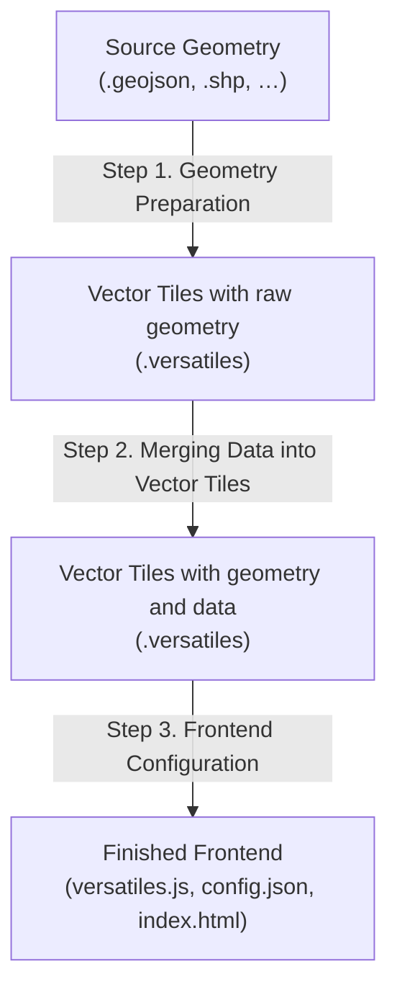

# VersaTiles Choro

**An open-source toolkit for creating, editing, and publishing choropleth maps — from raw geometries to fully interactive web visualizations.**

---

## Introduction

**VersaTiles Choro** is a modular, open-source workflow for building **choropleth maps** — maps where regions are colored according to data values.  
It is designed for newsrooms, data journalists, and developers who need an editorially controlled, reproducible way to visualize spatial data.

The system combines:
- a **Docker-based backend** for preparing and merging geometries,
- a **lightweight frontend** for displaying interactive maps, and
- a **Svelte-based configuration editor** for styling, tooltips, and behavior.

It enables anyone to create polished, data-driven maps with minimal technical overhead, while keeping all data local and reproducible.

---

## Concept Overview

VersaTiles Choro follows a three-step workflow — plus an optional developer layer for advanced customization.

### Step 1. Geometry Preparation

Import and build base geometries using tools such as tippecanoe.  
Supported formats: **GeoJSON** and **Shapefiles**.

You can:
- Define **minimum and maximum zoom levels**  
- Specify which fields and IDs to keep or rename  
- Automatically generate layers (`fill`, `stroke`, `center`). These layers represent polygon fill, outline strokes, and a single-point center used for labels or markers.  
- Attach metadata such as source, year, and zoom levels  
- Export standardized `.versatiles` containers ready for rendering

This step can run standalone or inside the same Docker environment as Step 2.

---

### Step 2. Merging Data into Vector Tiles

A **Docker container with a small GUI** lets users add their data to `.versatiles` containers.

Core features:
- Load geometries as `.versatiles` containers
- Load data as CSVs
- Match CSV data to geometry IDs
- Inspect layers visually in a WYSIWYG view
- View statistics about tile size, data density, and field coverage
- Export a ready-to-use `.versatiles` container

---

### Step 3. Frontend Configuration

The Docker container can open a `.versatiles` container and generate a preview of the data.  
The exported result is always a **minimal embeddable frontend** consisting of just two files:

```
index.html
config.json
versatiles-choro.js
```

`versatiles-choro.js` is a reusable JavaScript Library that contains a function `buildMap` that uses a `config.json` (config parameters define all map logic, colors, and tooltips) to build a MapLibre GL JS map.

`index.html` loads `versatiles-choro.js` and `config.json`, and runs the `buildMap` function to generate a map.

A **Svelte-based IDE** running in the Docker container provides a live editing interface:
- **Left panel:** config editor  
- **Right panel:** Live map preview  
- The IDE can include shared settings like fonts or color gradients, using a `default.json` configuration file.

Utilities:
- Gradient preview and color pickers  
- OSM background toggle  
- Tooltip configuration  
- Built-in console for validation and errors

The frontend is fully **responsive**, **lightweight**, and **embeddable** in any web page.

---

### 4. Hacking the Frontend

Developers can extend the resulting `index.html` to support custom:
- Arrows, markers, icons, and labels
- Hover effects and animations
- Color palettes
- ...

---

## Standard Geometries

VersaTiles Choro provides ready-to-use geometry packages for common use cases:

- **Administrative units (NUTS levels)**  
  - Country → State → District → Municipality → Sub-district  
- **Election boundaries**  
  - Constituencies and polling districts  
- **Regular grids**  
  - 1 km × 1 km and 100 m × 100 m cells  

Each geometry package contains:
- Unique IDs  
- `label_short`, `label_long`  
- Population data  
- Metadata including `source`, `year`, `fields`, and zoom levels

---

## Layer Architecture

Rendering order is predefined for consistent visuals:

1. Tooltips or other Hover elements  
2. Visualization strokes  
3. Visualization fills  
4. Background map layers  

Each layer can define:
- Active zoom range  
- Opacity per zoom level  
- Conditional styling rules

---

## Processing Steps

The system is designed as a **modular pipeline**:




### Key Components

- **Backend (Docker):**  
	- Geometry ingestion and tile generation  
	- Data merging with existing geometries  
	- Local map server  
	- Local web server for the IDE  
	- NodeJS scripts for server control and data management  
- **`versatiles-choro.js`:** JavaScript frontend library that generates a MapLibre map, applies color gradients, adds layers, legends, tooltips, etc.  
- **Config Editor (Svelte):** Simple IDE for map styling  

### Design Principles

- Modular: Each part can run independently or as part of the full stack  
- Deterministic: Every visualization is reproducible from source data  
- Open & transparent: All formats are open and documented  
- Note that in the long run the project might be developed further to run as a self hosted web service.
